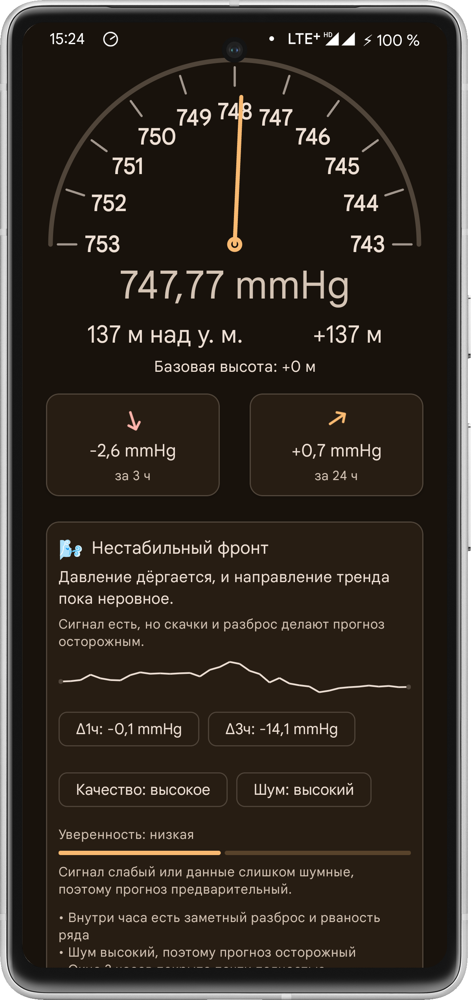
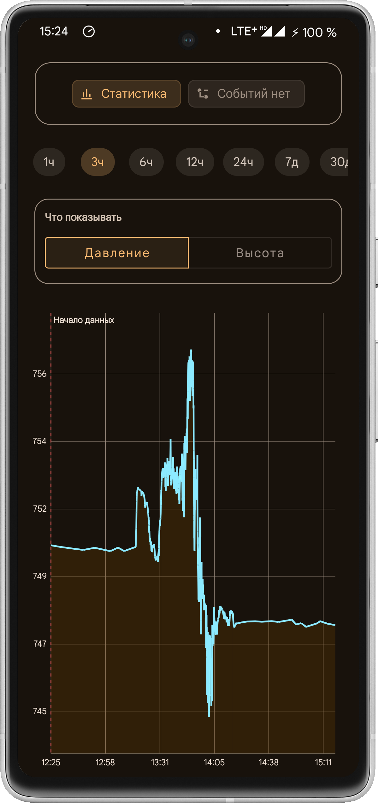
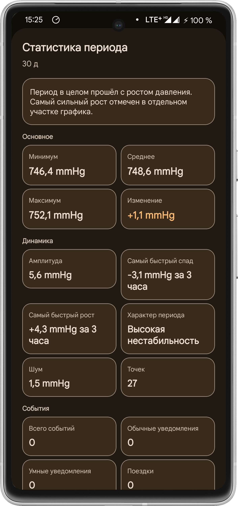
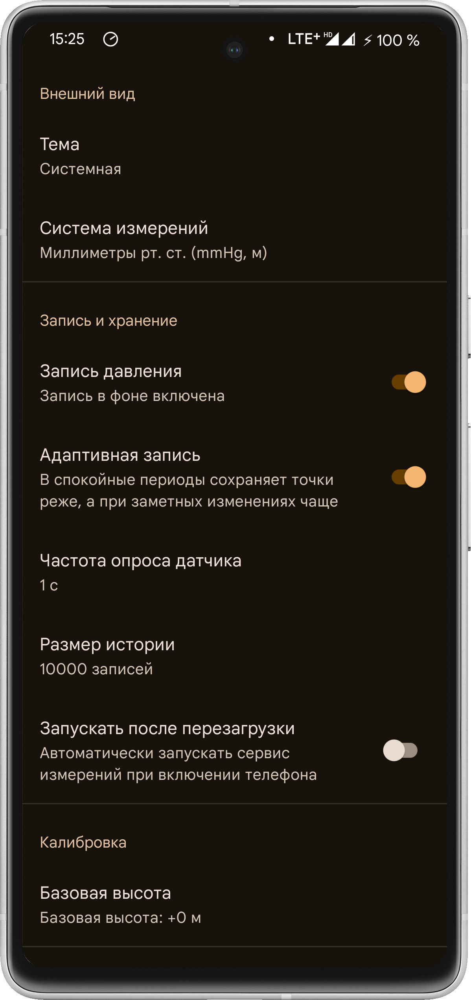

# Beautiful Barometer - мониторинг атмосферного давления

Приложение пишет давление в фоне, показывает изменения на графике, отмечает события, помогает замечать тенденции и не терять важные участки истории. Интерфейс сделан без лишнего шума: основной экран, график, уведомления, экспорт данных и настройки темы.

## Что умеет приложение

- запись атмосферного давления в фоне;
- просмотр текущего значения и общей тенденции;
- график истории за разные периоды;
- события и заметные изменения давления;
- обычные и более умные уведомления;
- режим поездки;
- адаптивная запись;
- экспорт истории;
- поддержка светлой, тёмной и системной темы;
- onboarding при первом запуске.

## Для чего это нужно

Приложение подойдёт тем, кто:

- следит за перепадами атмосферного давления;
- хочет видеть историю изменений, а не только текущее значение;
- замечает связь самочувствия с погодой;
- хочет иметь под рукой простой локальный инструмент без перегруженного интерфейса.

## Требования

- Android-устройство с датчиком атмосферного давления;
- Android Studio — для сборки из исходников;
- Android 8.0+

> Если на устройстве нет барометра, приложение корректно сообщает об этом при запуске.

## Скриншоты

```md




```

## Сборка проекта

1. Откройте проект в Android Studio.
2. Дождитесь синхронизации Gradle.
3. Соберите debug- или release-версию в зависимости от задачи.

### Release APK

Для релизной сборки:

1. Откройте меню **Build**.
2. Выберите **Generate Signed Bundle / APK**.
3. Выберите **APK**.
4. Укажите keystore и подпишите release-сборку.
5. После сборки установите APK на устройство и проверьте работу приложения.

## Установка готового APK

1. Скопируйте APK на устройство.
2. Разрешите установку из неизвестных источников, если система этого потребует.
3. Установите приложение как обычный APK-файл.

## Что внутри

Основные части приложения:

- **главный экран** — текущее давление, тенденции и прогноз;
- **график** — история изменений за выбранный период;
- **уведомления** — обычные и умные сценарии оповещений;
- **режим поездки** — помогает избежать ложных интерпретаций во время движения;
- **экспорт** — выгрузка истории для анализа или передачи;
- **настройки** — запись, хранение данных, темы и технические параметры.

## Стек

- Java
- Android SDK
- Room
- Foreground Service
- Material Components

## Статус проекта

**Версия 1.0.0** — первый стабильный релиз.

## Лицензия

MIT
