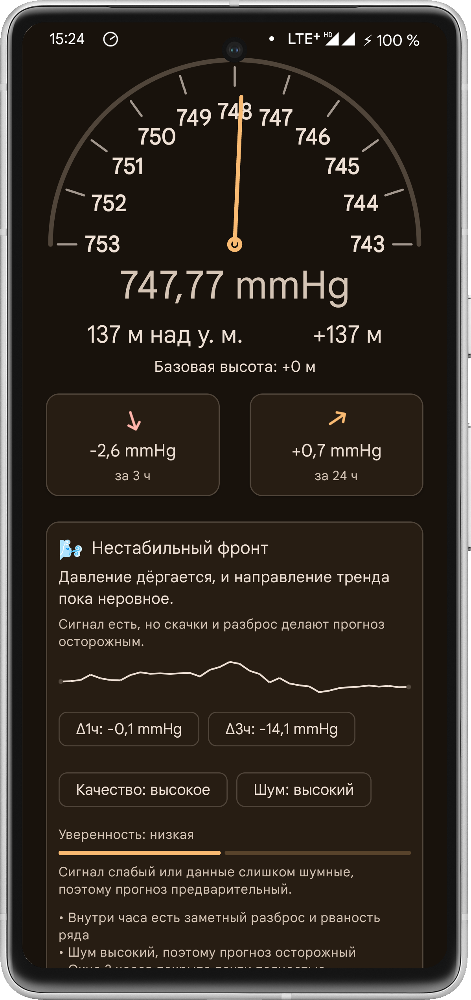
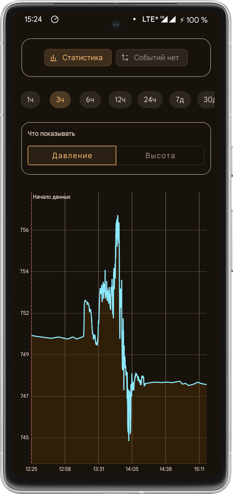
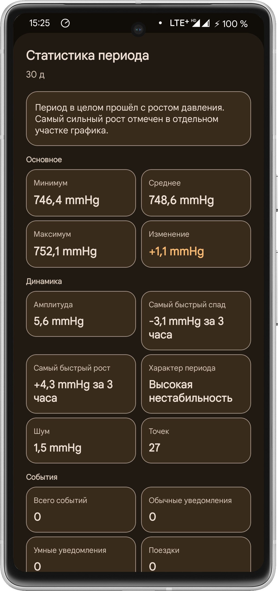
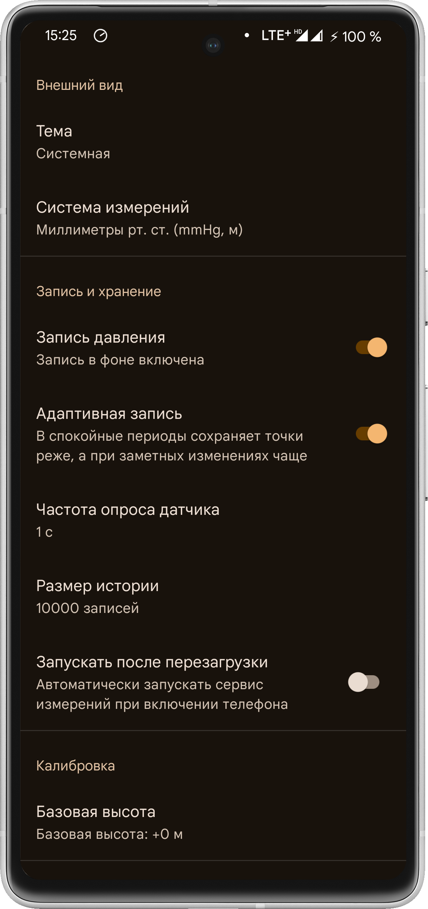

# Beautiful Barometer

Красивый локальный барометр для Android. Приложение пишет атмосферное давление с датчика телефона, строит историю, показывает тренды и помогает понять, когда давление растёт, падает или ведёт себя нестабильно.

Данные остаются на устройстве. Интернет для измерений не нужен.

[Скачать последнюю APK](https://github.com/gordeychernyshev/beautiful_barometer/releases/latest)

## Скриншоты

<p align="center">
  
  
  
  
</p>

| Главный экран | График | Статистика | Настройки |
| --- | --- | --- | --- |
| Текущее давление, высота, тренды и локальный прогноз. | История давления или высоты за выбранный период. | Минимум, максимум, среднее, амплитуда, шум и быстрые изменения. | Тема, единицы измерения, запись в фоне, автозапуск и калибровка. |

## Что умеет

- записывает атмосферное давление в фоне;
- показывает текущее давление, примерную высоту и изменение за 3 и 24 часа;
- строит график давления и высоты за выбранный период;
- считает статистику периода: минимум, максимум, среднее, амплитуду, шум, самый быстрый рост и спад;
- показывает локальный прогноз по тренду давления;
- оценивает качество данных, шум и уверенность прогноза;
- отмечает события на графике;
- умеет режим поездки, чтобы не путать смену высоты с погодой;
- отправляет обычные и умные уведомления о заметных изменениях давления;
- поддерживает плитку быстрых настроек для включения и выключения записи;
- экспортирует историю в CSV;
- поддерживает светлую, тёмную, системную и AMOLED-тему;
- собирает технический отчёт о сбое, если приложение упало.

## Зачем это нужно

Обычное погодное приложение показывает прогноз по району. Beautiful Barometer смотрит на давление прямо на устройстве и помогает заметить локальную динамику: резкое падение, нестабильный фронт, шумные данные, спокойный период или последствия поездки.

Приложение может быть полезно, если вы:

- следите за перепадами атмосферного давления;
- хотите видеть историю, а не только текущее значение;
- замечаете связь самочувствия с погодой;
- любите локальные инструменты без лишнего шума;
- хотите понимать, насколько данным вообще можно доверять.

## Как работает прогноз

Прогноз считается локально по истории давления. Приложение смотрит на тренд за несколько окон, оценивает шум, покрытие данных и согласованность сигнала.

Это не замена погодному сервису и не обещание точных осадков. Смысл прогноза другой: показать направление, нестабильность и качество текущего сигнала.

## Режим поездки

Барометр реагирует не только на погоду, но и на высоту. Если вы едете в машине, метро, поезде или быстро меняете высоту, график может резко прыгать. Режим поездки ставит прогноз на паузу, чтобы приложение не принимало движение за погодный фронт.

После завершения поездки прогноз снова считается по новым данным.

## Плитка быстрых настроек

В приложении есть Quick Settings tile: плитка в шторке Android. Она включает и выключает запись давления без открытия приложения.

Под плиткой показывается состояние записи: `Вкл.` или `Откл.`.

## Установка

1. Откройте [последний релиз](https://github.com/gordeychernyshev/beautiful_barometer/releases/latest).
2. Скачайте APK из блока `Assets`.
3. Установите APK на Android-устройство.
4. Если Android попросит, разрешите установку из неизвестных источников.

Для фоновой записи может понадобиться разрешить приложению работу без ограничений батареи. На некоторых прошивках, особенно MIUI, система может агрессивно останавливать фоновые сервисы.

## Требования

- Android 8.0 или новее;
- физический датчик атмосферного давления;
- разрешение на уведомления для постоянного фонового сервиса на новых версиях Android.

Если на устройстве нет барометра, приложение покажет предупреждение и не будет пытаться записывать несуществующие данные.

## Сборка из исходников

Проект написан на Java и собирается обычным Android Gradle Plugin.

Debug-сборка:

```bash
./gradlew assembleDebug
```

На Windows:

```powershell
.\gradlew.bat assembleDebug
```

Тесты:

```bash
./gradlew testDebugUnitTest
```

Release-сборка:

```bash
./gradlew assembleRelease
```

Для подписанной release-сборки нужен локальный keystore. В проекте поддержан локальный файл `keytrue` и Gradle-переменные `KEYTRUE_STORE_PASSWORD` и `KEYTRUE_KEY_PASSWORD`. Сам keystore не должен попадать в git.

## Docker-сборка

В репозитории есть Dockerfile и docker-compose для воспроизводимой debug-сборки без ручной установки Android SDK.

```bash
docker compose run --rm barometer-builder
```

По умолчанию контейнер запускает:

```bash
./gradlew assembleDebug
```

## Что внутри

- Java;
- Android SDK;
- Material Components;
- Room;
- Foreground Service;
- Quick Settings Tile;
- MPAndroidChart;
- локальное хранение истории и событий.

## Приватность

Beautiful Barometer не требует интернета для измерений. История давления, события, настройки и отчёты о сбоях хранятся локально на устройстве.

Экспорт CSV запускается вручную и сохраняет данные туда, куда выберет пользователь.

## Статус проекта

Текущая версия: `1.1.1`.

Проект развивается как небольшое личное Android-приложение: без серверной части, без аккаунтов и без внешней телеметрии.

## Лицензия

MIT
